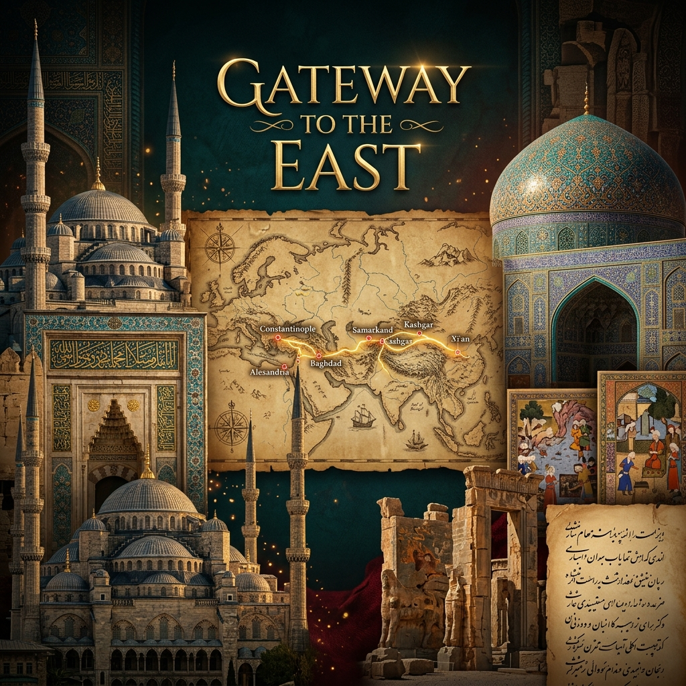
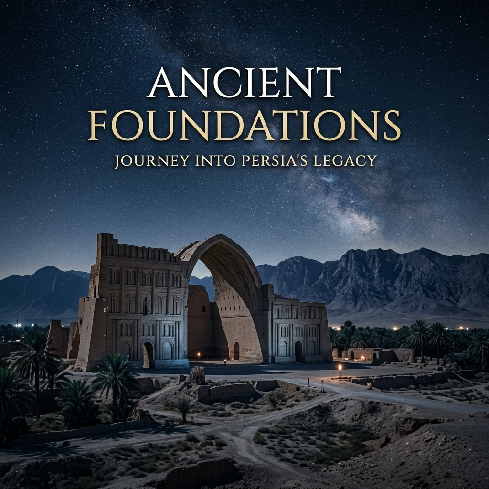
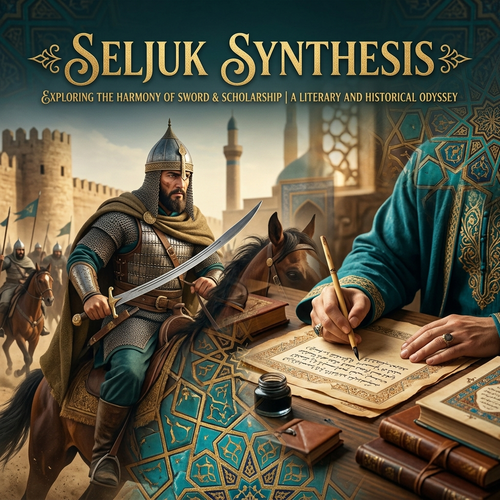
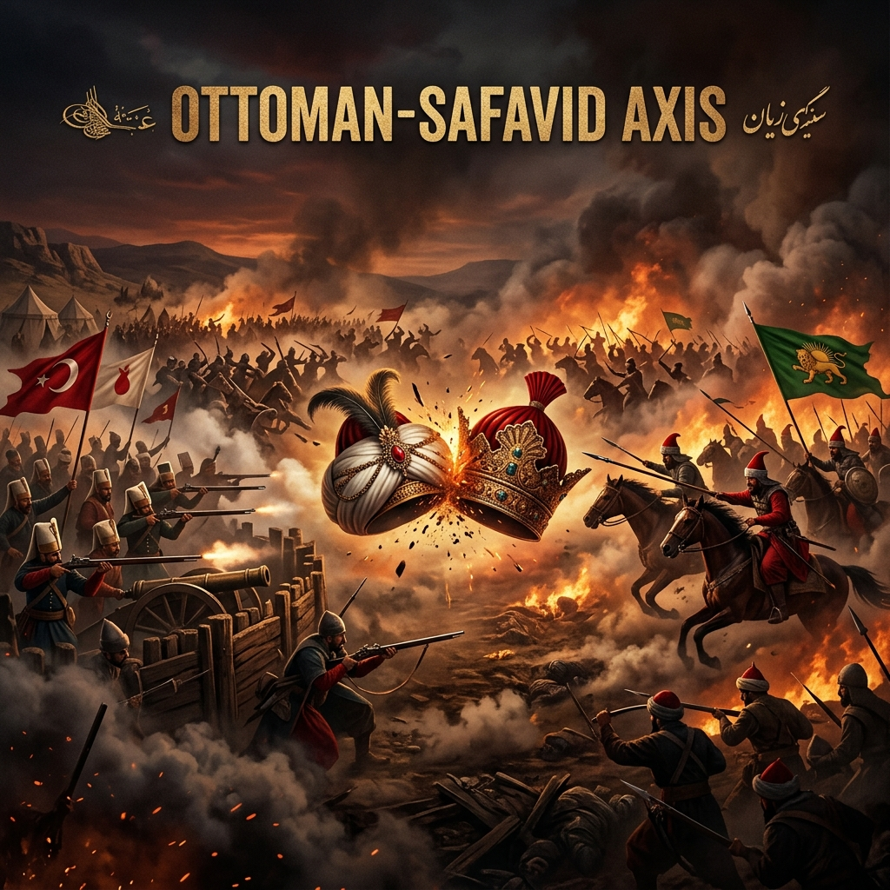
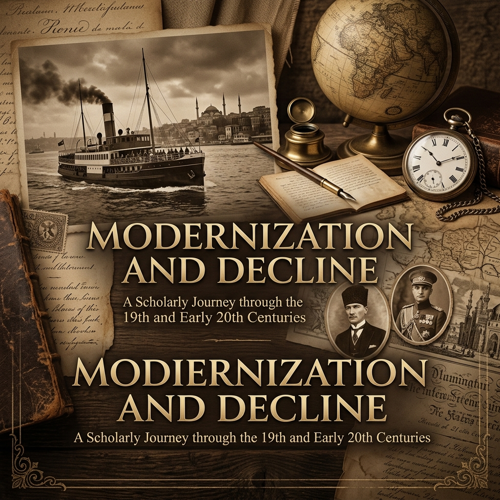
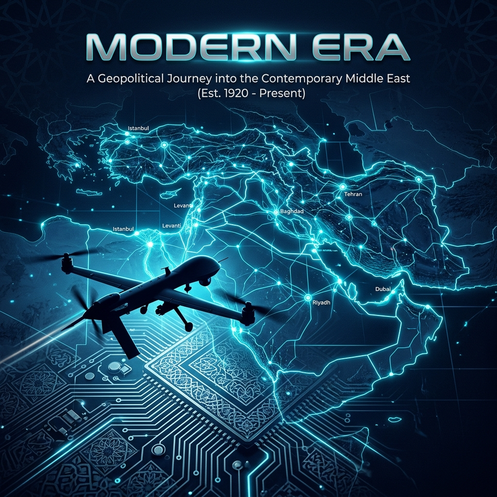

# 🌌 Gateway to the East: Doğu'nun Eşiğinde ve Tarihin Ontolojisi

> *"Zaman, bir nehir gibi akıp gitmez; bir derya gibi içimizde birikir. Geçmiş, arkamızda kalan bir gölge değil, her adımımızda toprağa düşen izimizdir. Doğu'nun kapısı, sadece bir mekâna değil, insanlığın kadim hakikatine açılır."*

---

## 📜 Mukaddime: Bir "Oluş" Olarak Tarih

**Gateway to the East**, Anadolu ve İran platosu arasındaki münasebetleri, sadece bir güç mücadelesi veya jeopolitik satranç olarak değil; bir **"tarihsel oluş" (historical becoming)** süreci olarak ele alır. Tarih, burada birer kuru vakadan ibaret değildir; o, her devirde kendini yeniden üreten bir ruhun, bir iradenin ve bir mukadderatın tecellisidir.

Bu çalışma, Doğu'nun kapısındaki bu iki devasa gücü, ontolojik bir derinlikle tahlil ederken; kılıcın keskinliği ile kalemin zarafeti arasındaki o ebedi diyalektiği keşfetmeyi amaçlar.

---

## 🏛️ FELSEFİ ÇERÇEVE: Zaman, Mekan ve Devletin Metafiziği

Tarihi anlamak, onun felsefi çekirdeğine nüfuz etmeyi gerektirir. Bu portalın temelini oluşturan felsefi ilkeler şunlardır:

### 1. Hareket ve İstikrar Diyalektiği: Bozkır ve Şehir
Türk-İran münasebetlerinin temelinde, bozkırın dinamik "hareket" enerjisi (Turani unsur) ile yerleşik medeniyetin "istikrar" ve "biçim" arayışı (İrani unsur) arasındaki diyalektik yatar. Bu, Hegelci anlamda bir çatışma değil; bir terkip, bir sentez arayışıdır. Türk'ün kılıcı mekânı fethederken, İran'ın kalemi bu mekâna bir ruh, bir nizam ve bir süreklilik kazandırmıştır.

### 2. Bir Yaşayan Organizma Olarak Devlet
İbn Haldun'un asabiyet teorisinden beslenen bu yaklaşımda, devlet; kuru bir kurum değil, doğan, büyüyen, istihale geçiren ve hafızasını kuşaktan kuşağa aktaran metafizik bir organizmadır. Sasani'den Selçuklu'ya, Osmanlı'dan modern döneme aktarılan "Devlet-i Ebed-Müddet" fikri, bu ontolojik sürekliliğin bir nişanesidir.

### 3. Eşik ve Sınır Felsefesi: Zagros'un Metafiziği
Sınır, burada sadece fiziki bir hat değildir; o, bir medeniyetin bittiği ve diğerinin başladığı bir "eşik"tir. Zagros Dağları, tarihsel süreçte bir engel olmanın ötesinde, her iki tarafın da kendi içsel hakikatine dönmesini sağlayan bir ayna vazifesi görmüştür. Bu sınır, bir ayrılık değil, bir "tanışıklık" ve "karşılıklı beka" zaruretidir.

---

## 🏛️ FASIL I: Kadim Temeller ve Ontolojik Kökler

Bölüm I, sistemin "boot" edildiği değil, ruhun üflendiği kadim zamanlara odaklanır.

*   **Sasani Mirası:** Devletin bir "müesses nizam" olarak kutsallaşması.
*   **Zerdüştlükten İrfana:** Işık ve karanlığın savaşı üzerinden şekillenen düalist dünya görüşünün, Doğu siyaset felsefesindeki yansımaları.
*   **Coğrafi Mukadderat:** Mekânın insan iradesi üzerindeki amir hükmü.

---

## ⚔️ FASIL II: Selçuklu Sentezi ve Hikmetin Tecellisi

Türklerin İslam dairesine girişiyle birlikte yaşanan o büyük sentez, hikmet (wisdom) ve kudretin buluşmasıdır.

*   **Nizamülmülk'ün Siyaset Felsefesi:** Adaletin mülkün temeli olduğu hakikati üzerinden yükselen idari mimari.
*   **Kılıç ve Kalem İttifakı:** Askeri deha ile bürokratik zekânın, bir cihan nizamı kurmak üzere imtizaç etmesi.
*   **Medrese ve Marifet:** Bilginin, devletin bekası için stratejik bir güç olarak yeniden tanımlanması.

---

## 🛡️ FASIL III: Osmanlı - Safevi Ekseni ve İdeolojik İstihale

Bu dönem, Doğu'nun kendi içinde yaşadığı en büyük içsel yarılma ve aynı zamanda en derin tanışma dönemidir.

*   **Mezhepsel Diyalektik:** Sünni ve Şii tasavvurlarının, devletin kimlik inşasındaki kurucu rolleri.
*   **Çaldıran ve Teknolojinin Ruhu:** Ateşli silahların, geleneksel kahramanlık mitini nasıl dönüştürdüğünün felsefi tahlili.
*   **Sanatsal Sempiyoz:** Savaşın gölgesinde yeşeren şiir, minyatür ve hat sanatındaki o ortak estetik dil.

---

## 📉 FASIL IV: Çöküşten Varoluşa (19. - 20. Yüzyıl)

Batı’nın materyalist ve seküler meydan okuması karşısında, Doğu’nun kendi özgün modernitesini arayış süreci.

*   **Büyük Oyun ve İrade Kaybı:** Emperyal güçlerin gölgesinde, devlet iradesinin nasıl bir tampon bölgeye dönüştüğünün trajedisi.
*   **Savunmacı Modernleşme:** Taklit ile özgünlük arasındaki o ince çizgide yürütülen reformların felsefi eleştirisi.
*   **Cumhuriyet ve Pehlevi Devrimleri:** Kadim monarşiden ulus-devlet formuna geçişin ontolojik sancıları.

---

## 📡 FASIL V: Modern Dönem ve Geleceğin Şafağı

Bugünün jeopolitiği, geçmişin o devasa birikiminin modern bir dil ve teknolojiyle yeniden tezahür etmesidir.

*   **1979 Devrimi ve İdeolojik Kernel:** Devlet aklının teokratik bir perspektifle "reset" edilmesi ve bunun küresel etkileri.
*   **Vekalet Savaşları ve Asimetrik Varlık:** Gücün artık ordularda değil, ağlarda ve etkileşimlerde toplandığı yeni savaş felsefesi.
*   **Siber Mekân ve Dijital Egemenlik:** Kadim beka mücadelesinin bitler ve baytlar dünyasındaki yeni cepheleri.

---

## 🌳 Arşiv Yapısı ve Bilgi Arkeolojisi

Bu portal, tarihin derinliklerinde bir "bilgi arkeolojisi" yapmak üzere tasarlanmıştır:

*   **01-07 Bölümleri:** Her biri, tarihin farklı bir katmanını, farklı bir hakikatini temsil eden modüler arşiv birimleri.

---

## 🤝 İştirak ve Hakikat Arayışı

Buradaki her satır, tarihin o devasa deryasında bir damla olma gayretindedir. Katkılarınız, sadece veri eklemek değil, bu kadim hikâyeye yeni bir yorum katmak olacaktır.

---

## 🌠 Epilog: Doğu'nun Ebedi Kapısı

Doğu, güneşin doğduğu yer olduğu kadar, hikmetin de kaynağıdır. **Gateway to the East**, bu kapıdan içeri giren her araştırmacıyı, sadece geçmişin tozlu sayfalarıyla değil, kendi kökenlerinin o derin hakikatiyle de yüzleşmeye davet eder. Zira tarih, sadece olan biten değil, hala olmakta olandır.

---

**Lisans:** MIT License

---

  <i>"Işık Doğu'dan yükselir; ancak onu görecek bir göz, anlayacak bir gönül gerekir."</i>

